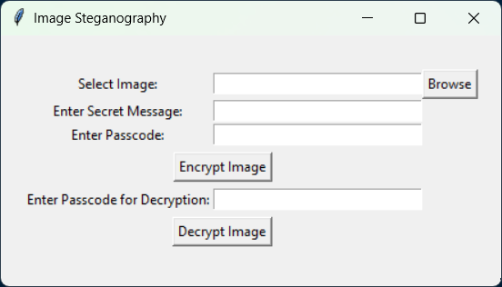

# 🔒 Secure Data Hiding in Images Using Steganography  

## 📌 Project Overview  
This project implements **image-based steganography**, allowing users to **hide and retrieve secret messages** within images securely. Using **OpenCV and Tkinter**, it provides an intuitive **GUI for encryption and decryption** while ensuring **lossless data retrieval** with password protection.  

---

## ✨ Features  
✔ **User-Friendly GUI** – Simple interface for selecting images and hiding/retrieving messages.  

✔ **Secure Message Encryption** – Data is embedded in image pixels without noticeable distortion.  

✔ **Password Protection** – Prevents unauthorized access to hidden messages.  

✔ **Lossless PNG Format** – Ensures accurate message retrieval without data loss.  

✔ **Cross-Platform Support** – Works on Windows, macOS, and Linux.  

---

## 📷 Screenshots  
### **1️⃣ GUI for Encryption & Decryption**  
<p align="center">
  
</p>

### **2️⃣ Encrypted Image Output**  
<p align="center">
  
</p>
 

---

## 🔧 Installation & Setup  

### **1️⃣ Clone the Repository**  
Open a terminal or command prompt and run:  
```bash
git clone https://github.com/yourusername/steganography-project.git
cd steganography-project
```

### **2️⃣ Install Dependencies**  
Ensure you have Python installed (recommended version: Python 3.8+).  
Then install the required libraries:

```bash
pip install opencv-python tkinter numpy
```

### **3️⃣ Run the Application**  
Execute the following command to launch the GUI:

```bash
python gui.py
```

---

## 🚀 How to Use  

### 🔹 Encrypt a Message into an Image  
1️⃣ Click "Browse" to select an image.  

2️⃣ Enter the secret message you want to hide.  

3️⃣ Set a passcode to protect the message.  

4️⃣ Click "Encrypt Image", and the encrypted image will be saved.  

### 🔹 Decrypt a Message from an Image  
1️⃣ Click "Browse" and select the encrypted image.  

2️⃣ Enter the same passcode used during encryption.  

3️⃣ Click "Decrypt Image" to reveal the hidden message.  


⚠ **Note:** Only PNG images should be used to prevent data loss during encryption.  

---

## 📌 Technologies Used  
- **Python** 🐍  

- **OpenCV (cv2)** – Image processing  

- **Tkinter** – GUI framework  

- **NumPy** – Array manipulations  

- **OS Module** – File handling  

---

## 🚀 Future Scope  
✅ Advanced encryption techniques for stronger security.  

✅ Support for multiple image formats (BMP, GIF, TIFF).  

✅ AI-based detection prevention for stealthier data hiding.  

✅ Mobile & Web-based versions for wider accessibility.  

---

⭐ Don't forget to give this repository a star if you found it useful! ⭐
